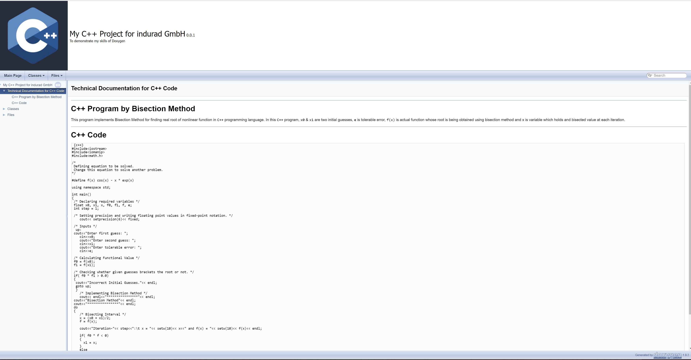
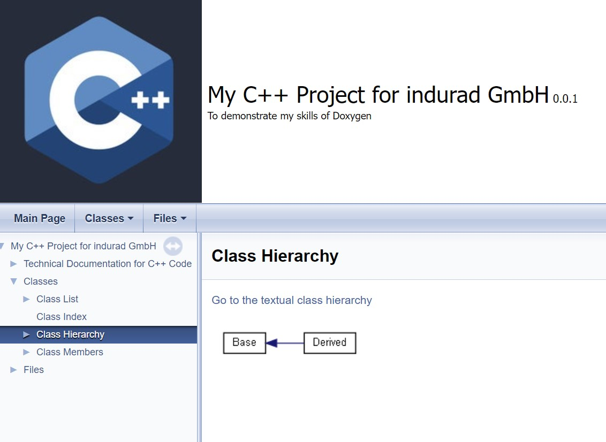
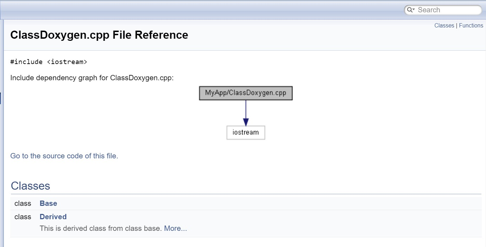
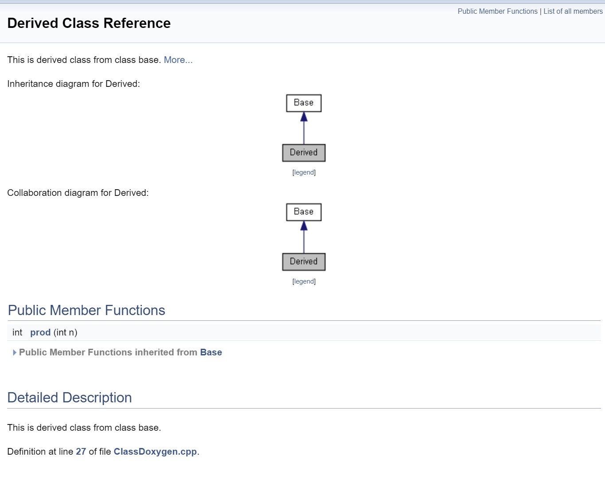
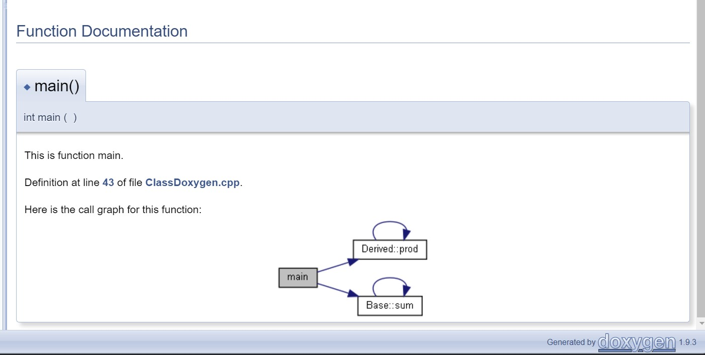
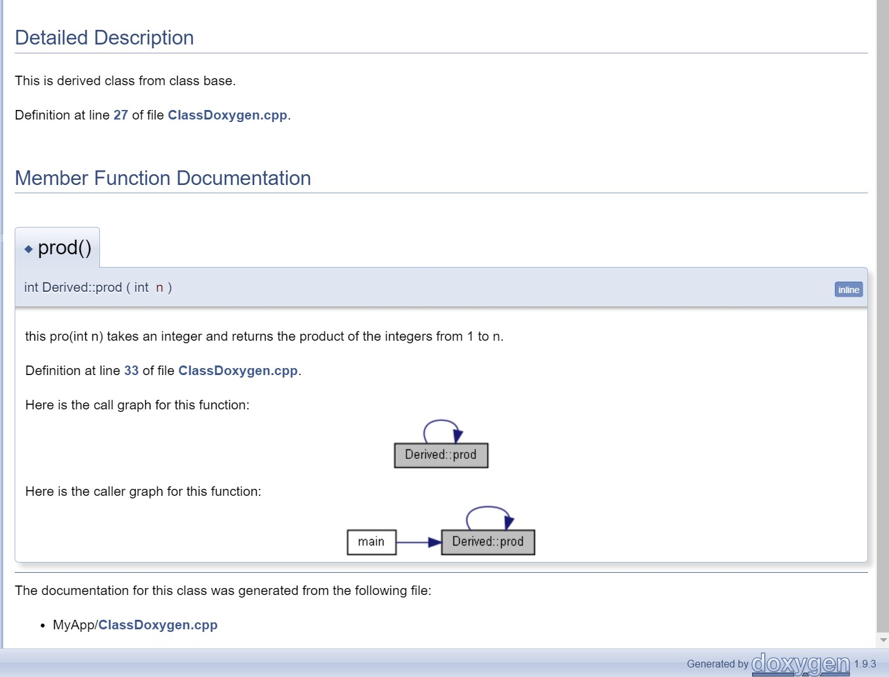

# Doxygen-C-code-Documentation
Doxygen C++ code Documentation

# My C++ Project for indurad GmbH

## To demonstrate my skills of Doxygen

---

I have created sample `C++` code for the **Bisection Method** by using **Doxygen**.

First, download entire repository on your Desktop or Laptop.

Then follow the path `/Documentation/html`.

Please open `index.html`

I am attaching few screenshots below for quick reference.

